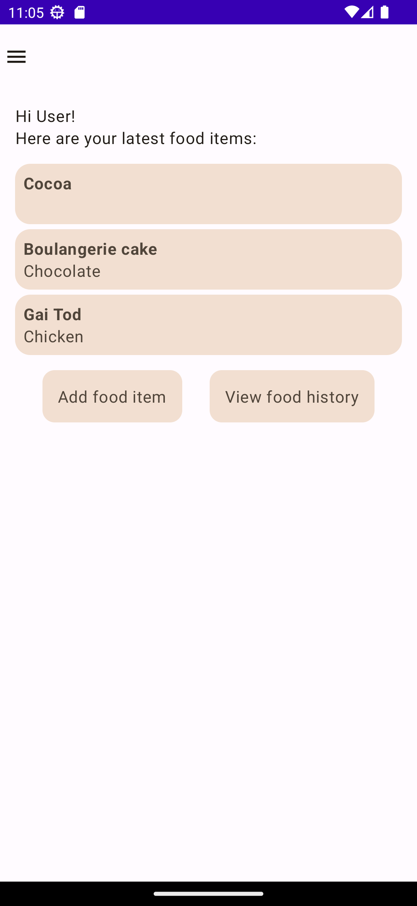
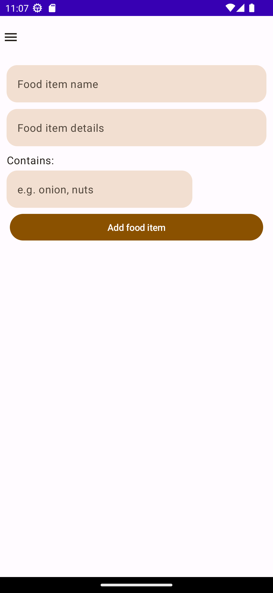
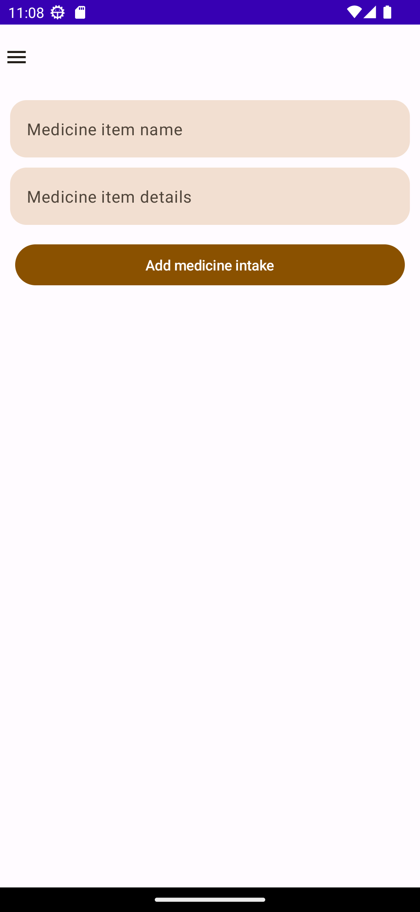
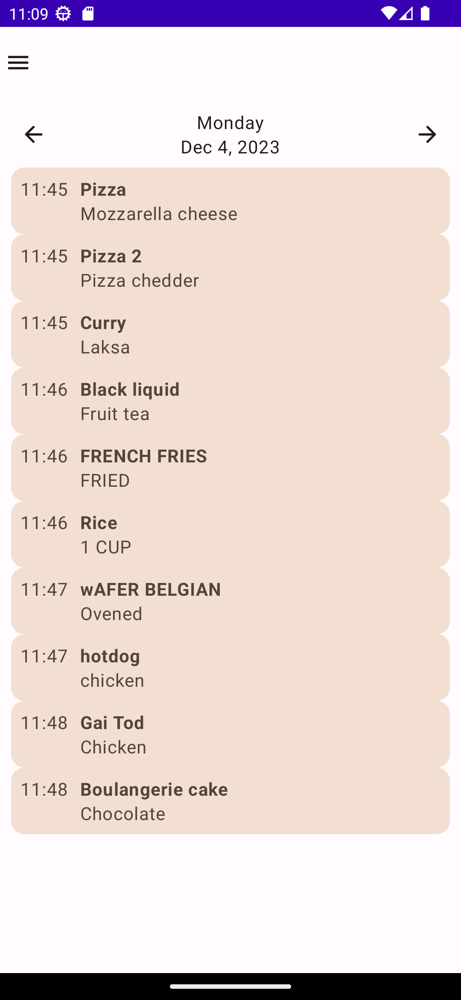
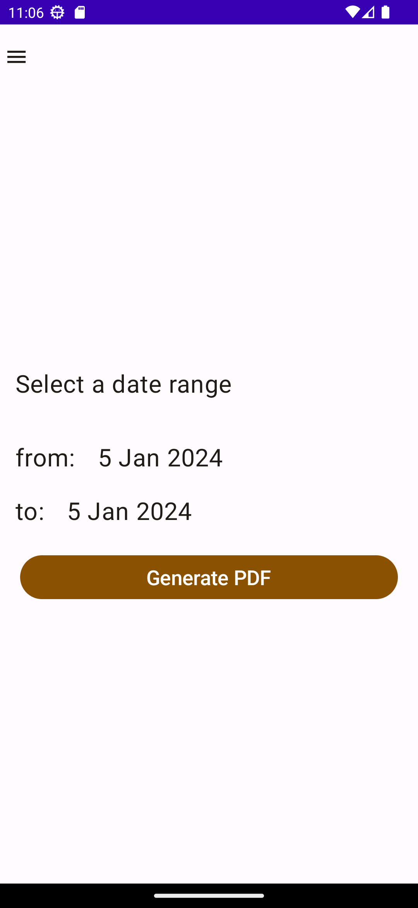

# NoteEat (formerly FoodDiaryKotlin)
A personal app intended for saving information of daily food intake. It is a native Android app made in Kotlin, with its UI now built using [Jetpack Compose](https://developer.android.com/jetpack/compose).

This app is primarily created as a way for me to track the food that I have eaten daily as I am suffering from occasional acid reflux. I also created this app to reinforce specific concepts in Android app architecture that I am trying to learn such as ViewModels, Room database, Coroutines and View Binding. 

This app is continuously being developed in terms of the UI and features.

### Features:
- Add a food or medicine item and its details (name, details and other specific ingredients)
- View food item history 
- View the three latest food items added to the app
- Date range selection for generation of food list 
- Generate PDF file for a food list from a given date range

### Features that are yet to be implemented:
- Modify details of food items
- Complete app theme
- Other UI components (custom dialogs, UI displays for ongoing pages)

### Screenshots and screen records: 

- Home page

- Add food item page

- Add medicine item page

- View food item history page

- Print food item history page

(Screen records for the app's newest version are yet to be uploaded)
